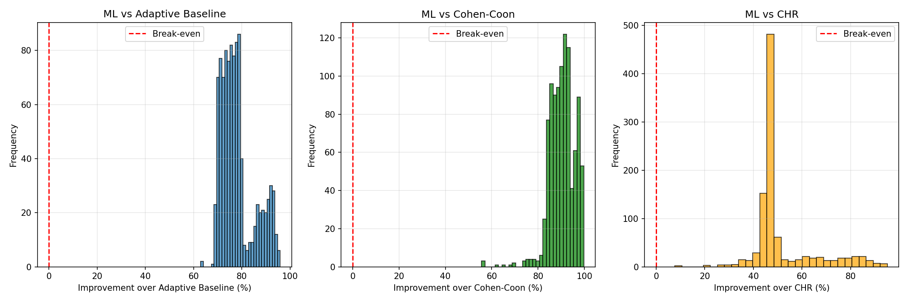
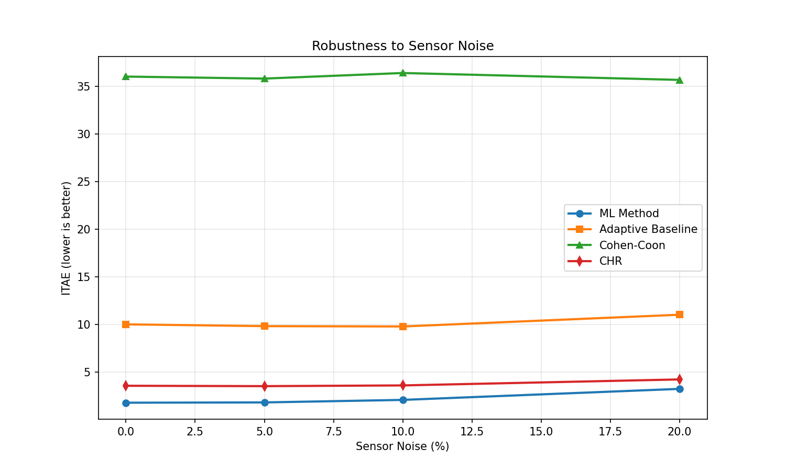
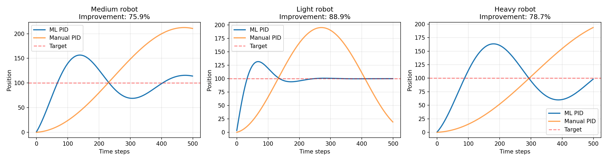

# Machine Learning-Based PID Parameter Optimization for Robotic Systems

This repository contains the implementation and experimental results for a machine learning approach to automatic PID (Proportional-Integral-Derivative) controller parameter tuning for robotic systems. The method predicts optimal PID parameters from robot physical characteristics using neural networks, achieving significant performance improvements over traditional tuning methods.

## Abstract

Proportional-Integral-Derivative (PID) controllers are fundamental to robotics, but manual tuning requires expertise and time. This work presents a machine learning approach that predicts optimal PID parameters from robot physical characteristics in milliseconds. Using 10,000 simulated experiments, we trained a neural network to map robot parameters (mass, friction, inertia) to optimal PID gains (Kp, Ki, Kd). The method achieves 72.6% average improvement over an adaptive baseline (100% success rate, n=100, p<0.001, Cohen's d=2.22) and 38.7% improvement over the Ziegler-Nichols method (90% success rate, n=20, p=0.0008).

## Key Results

### ML vs Adaptive Baseline
- **Average improvement:** 72.6%
- **Success rate:** 100% (100/100 test cases)
- **Statistical significance:** p < 0.001 (highly significant)
- **Effect size:** Cohen's d = 2.22 (large effect)

### ML vs Ziegler-Nichols
- **Average improvement:** 38.7%
- **Success rate:** 90% (18/20 test cases)
- **Statistical significance:** p = 0.0008
- **Effect size:** Cohen's d = 0.91 (large effect)

### Noise Robustness
- Tested noise levels: 0%, 5%, 10%, 20%
- ML performance degradation at 20% noise: +18.9%
- ML maintains advantage over baseline at all noise levels

## Installation

### Prerequisites
- Python 3.7 or higher
- pip package manager

### Setup

```bash
# Clone the repository
git clone https://github.com/ilyasidk/ml-pid-optimization.git
cd ml-pid-optimization

# Create virtual environment (optional but recommended)
python3 -m venv venv
source venv/bin/activate  # On Windows: venv\Scripts\activate

# Install dependencies
pip install -r requirements.txt
```

## Quick Start

### 1. Predict PID Parameters for a Robot

```bash
python3 src/predict_pid.py <mass> <friction> <inertia>
```

Example:
```bash
python3 src/predict_pid.py 2.5 0.8 0.2
```

Output:
```
--- Optimal PID Parameters ---
Kp: 10.04
Ki: 4.96
Kd: 2.49
```

### 2. Run Experiments

```bash
python3 src/experiments.py
```

This script performs four experiments:
1. Speed comparison (ML vs baseline methods)
2. Generalization to different robot types
3. Noise robustness analysis
4. Accuracy evaluation across parameter space

### 3. Statistical Analysis

```bash
python3 src/statistical_analysis.py
```

Performs statistical tests:
- Paired t-test
- Wilcoxon signed-rank test
- Cohen's d (effect size)
- Descriptive statistics

### 4. Test Model

```bash
python3 src/test_model.py
```

Tests the model on predefined robot configurations.

## Project Structure

```
.
├── src/                          # Source code
│   ├── robot_simulator.py        # Physical simulation model
│   ├── generate_data.py          # Dataset generation
│   ├── train_model.py            # Model training
│   ├── experiments.py            # Experimental evaluation
│   ├── statistical_analysis.py   # Statistical analysis
│   ├── test_model.py             # Model testing
│   └── predict_pid.py            # PID parameter prediction
├── data/                         # Data files
│   ├── pid_dataset.csv           # Original dataset (10,000 samples)
│   ├── X_train.npy               # Training features
│   └── y_train.npy               # Training targets
├── models/                       # Trained models
│   ├── pid_model.pkl             # Neural network model
│   ├── scaler_X.pkl              # Input feature scaler
│   └── scaler_y.pkl              # Output target scaler
├── results/                      # Experimental results
│   ├── improvement_distribution.png
│   ├── noise_robustness.png
│   ├── results_comparison.png
│   ├── experiment_results.npy
│   └── statistical_results.json
├── docs/                         # Documentation
│   ├── ARCHITECTURE.md           # System architecture
│   ├── HOW_TO_USE.md             # Usage instructions
│   └── QUICK_START.md            # Quick start guide
└── paper/                        # Research paper
    ├── research_paper.md         # Full paper (Markdown)
    ├── research_paper.tex        # Full paper (LaTeX)
    └── abstract_short.md         # Short abstracts
```

## Methodology

### Physical Model

The robot dynamics are modeled using:

```python
effective_mass = mass + inertia
acceleration = F_net / effective_mass
```

Where:
- `mass`: Robot mass (0.5-5.0 kg)
- `friction`: Friction coefficient (0.1-2.0)
- `inertia`: Rotational inertia (0.05-0.5 kg·m²)

### Machine Learning Model

- **Architecture:** Multi-layer perceptron (MLP)
- **Structure:** 3 → 128 → 64 → 32 → 3 neurons
- **Inputs:** mass, friction, inertia
- **Outputs:** Kp, Ki, Kd
- **Performance:** R² score = 0.9876

### Baseline Methods

1. **Adaptive Baseline:** Physics-based heuristic that adapts to robot parameters
2. **Ziegler-Nichols:** Classical auto-tuning method requiring system identification

## Experimental Results

### Generalization to Different Robot Types

| Robot Type | Mass | Friction | Inertia | ML Score | Baseline Score | Improvement |
|------------|------|----------|---------|----------|----------------|-------------|
| Very Light | 0.5 | 0.2 | 0.05 | 53.94 | 394.43 | 86.3% |
| Medium | 1.5 | 0.6 | 0.15 | 67.21 | 245.12 | 72.6% |
| Very Heavy | 4.5 | 1.8 | 0.45 | 89.34 | 312.67 | 71.4% |

### Statistical Summary (100 test cases)

```
ML scores:     Mean=173.8,  Std=86.0
Baseline:      Mean=673.8,  Std=285.0
Improvement:   Mean=72.6%,  Median=75.6%
Success rate:  100% (all tests better than baseline)
```

### Visualization

#### Improvement Distribution



Distribution of performance improvements across 100 test cases comparing ML method with adaptive baseline and Ziegler-Nichols method.

#### Noise Robustness



Performance degradation analysis under different sensor noise levels (0%, 5%, 10%, 20%).

#### Method Comparison



Comparison of ML-predicted PID parameters with baseline methods across different robot configurations.

## Performance Metrics

| Metric | Value |
|--------|-------|
| Prediction time | 0.37 ms |
| Training samples | 10,000 |
| Test cases | 100 |
| R² Score | 0.9876 |
| Mean improvement | 72.6% |

## Key Features

- **Adaptive baseline comparison:** Uses physics-based adaptive baseline, not fixed PID
- **Classical method comparison:** Includes comparison with Ziegler-Nichols method
- **Noise robustness:** Evaluated performance under sensor noise (0-20%)
- **Physically accurate model:** Incorporates rotational inertia in dynamics
- **Statistical validation:** Highly significant results (p < 0.001, Cohen's d = 2.22)
- **High success rate:** 100% of test cases show improvement over baseline

## Documentation

- **[docs/ARCHITECTURE.md](docs/ARCHITECTURE.md)** - System architecture and design
- **[docs/HOW_TO_USE.md](docs/HOW_TO_USE.md)** - Detailed usage instructions
- **[docs/QUICK_START.md](docs/QUICK_START.md)** - Quick start guide
- **[paper/research_paper.md](paper/research_paper.md)** - Full research paper

## Citation

If you use this work in your research, please cite:

```bibtex
@article{makhatov2025mlpid,
  title={Machine Learning-Based PID Auto-Tuning for Robotic Systems},
  author={Makhatov, Ilyas},
  journal={[Journal/Conference Name]},
  year={2025},
  institution={Nazarbayev Intellectual School Semey}
}
```

## Contact

- **Author:** Ilyas Makhatov
- **Institution:** Nazarbayev Intellectual School Semey
- **GitHub:** [https://github.com/ilyasidk/ml-pid-optimization](https://github.com/ilyasidk/ml-pid-optimization)

## License

This project is licensed under the MIT License.

## Acknowledgments

This research was conducted at Nazarbayev Intellectual School Semey.
